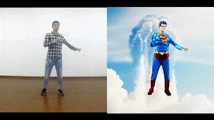
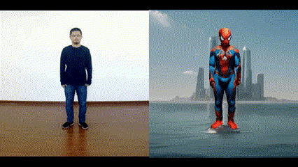
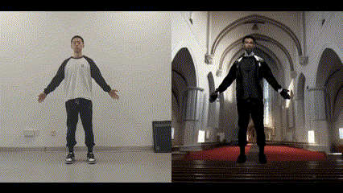
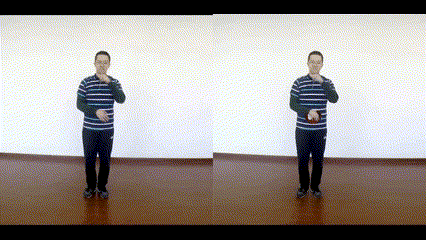
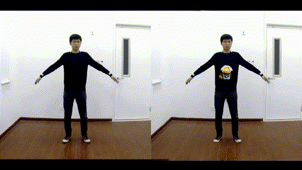
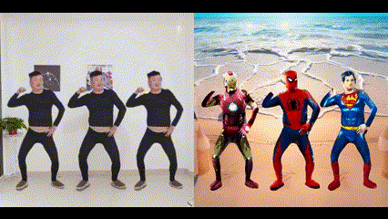

# HeroMaker
[ACM MM 2024 oral] The official repo for the  paper "HeroMaker: Human-centric Video Editing with Motion Priors".

[paper](./assets/paper.pdf)


## Introduction
HeroMaker is a multi-stage framework for human-centric video editing. This repo have four parts:
- [Preprocessing](./preprocessing/) includes segmenting the video into foreground and background.
- [Acquisition of Motion Prior](./motion_acquiring/) includes extracting the original human body mesh and key-points, as well as subsequent motion prior optimization.
- [Video Reconstruction](./video_reconstruction/) includes the code to build canonical fields to reconstruct videos. 
- [Video Editing](./video_editing/) includes the code about video editing using prompt or user input.

Please follow the content of each part.

## Results

### Video Editing Results Using Prompt
<!-- 

 -->

<div style="display: flex; justify-content: space-between;">
  
  
  
</div>

### Video Editing Results with User Input




### Multi People Video Editing Results



## Acknowledge
We build our code base from: [OSX](https://github.com/IDEA-Research/OSX), [mmpose](https://github.com/open-mmlab/mmpose/tree/main), [CoDeF](https://github.com/qiuyu96/CoDeF), [iPERCore](https://github.com/iPERDance/iPERCore), 

## BibTeX
If you find our work useful in your reasearch, please consider citing:
```
@inproceedings{
liu2024heromaker,
title={HeroMaker: Human-centric Video Editing with Motion Priors},
author={Shiyu Liu and Zibo Zhao and Yihao Zhi and Yiqun Zhao and Binbin Huang and Shuo Wang and Ruoyu Wang and Michael Xuan and Zhengxin Li and Shenghua Gao},
booktitle={ACM Multimedia 2024},
year={2024},
}
```